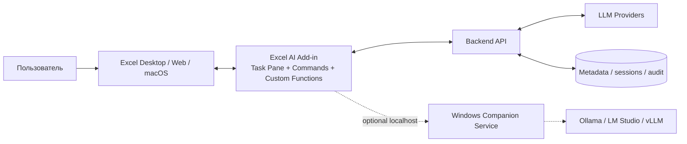
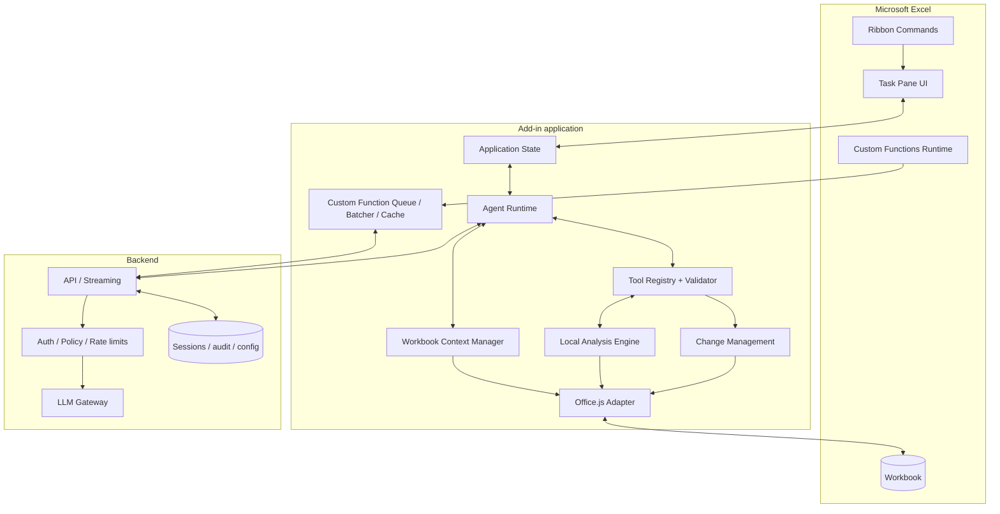
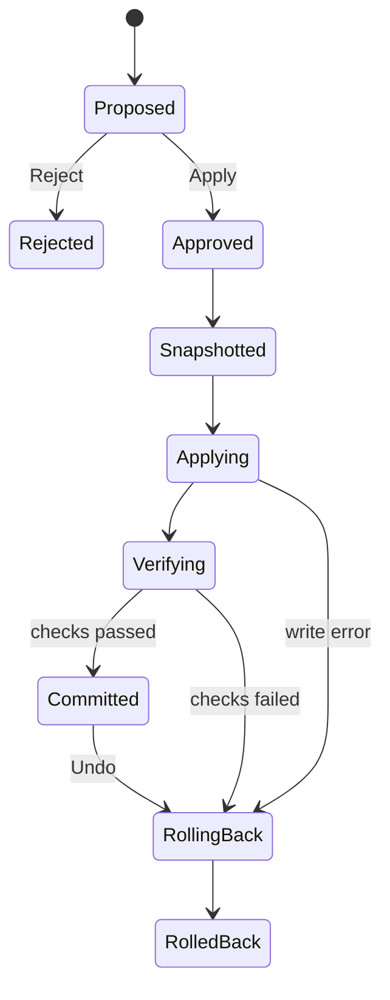
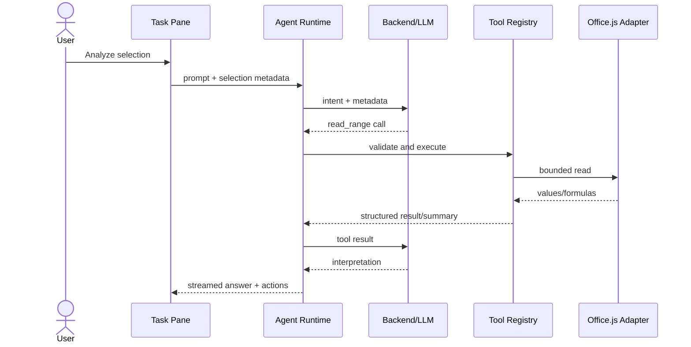
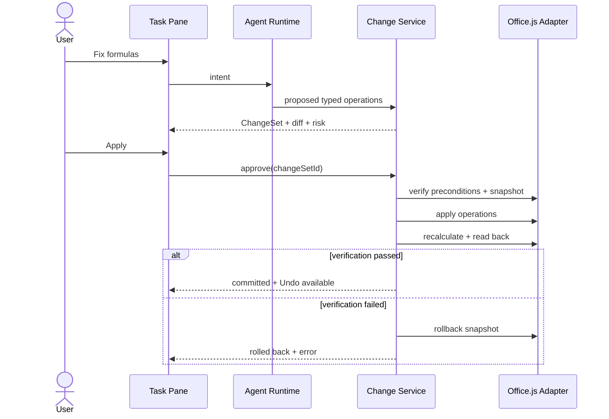

# Архитектура Excel AI Assistant

**Статус:** Proposed  
**Основание:** `documentation/README.MD`, версия ТЗ 1.0  
**Целевая поставка:** Microsoft Excel Add-in, в первую очередь Excel Desktop для Windows  
**Совместимость:** Excel Desktop Windows, Excel Web, Excel Desktop macOS

## 1. Архитектурная позиция

Продукт реализуется как Office Web Add-in: React-приложение открывается в Task Pane внутри Excel, а доступ к книге получает только через Office.js. Для пользователя Windows это выглядит как установленное расширение Excel, но основной UI и бизнес-логика не являются самостоятельным Win32-приложением.

Windows-only код не включается в ядро add-in. Если позднее потребуются Ollama/LM Studio, Windows Credential Manager, доступ к локальным файлам или корпоративные агенты, они подключаются через отдельный **Windows Companion Service**. Add-in должен полноценно работать без него.

Ключевые инварианты:

1. LLM никогда не вызывает Office.js напрямую.
2. Полная книга не читается и не отправляется модели автоматически.
3. Read-операции проходят через Tool Registry и policy checks.
4. Write-операции сначала формируют ChangeSet и не меняют книгу до подтверждения.
5. Destructive-операции получают отдельное явное подтверждение.
6. Перед записью создаётся snapshot; после записи выполняются recalculation и verification.
7. Результат можно откатить через rollback/undo.
8. Данные из ячеек всегда считаются недоверенными данными, а не инструкциями.

## 2. Контекст системы



### Границы доверия

- **Excel workbook:** содержит пользовательские и потенциально вредоносные данные.
- **Add-in:** доверенная среда исполнения, но не место для production API keys.
- **Backend:** единственная production-точка доступа к внешним LLM и корпоративным политикам.
- **LLM provider:** внешняя недоверенная система с минимально необходимым контекстом.
- **Companion service:** отдельная локальная доверенная зона; выключена по умолчанию.

## 3. Логическая архитектура



## 4. Компоненты add-in

### 4.1 Task Pane

React + TypeScript + Fluent UI. Содержит chat, context bar, quick actions, activity stream, preview изменений, approve/reject, history/undo и settings. UI не выполняет Excel-команды напрямую: он отправляет intent/use case в application layer.

### 4.2 Ribbon Commands

Минимальные команды MVP:

- открыть AI Assistant;
- Analyze selection;
- Explain/Fix formula;
- Undo last AI change.

Commands должны быть тонкими entry points и вызывать общие application services.

### 4.3 Office.js Adapter

Единственная точка работы с Excel JavaScript API. Отвечает за:

- `Excel.run` и `context.sync()`;
- нормализацию адресов, значений, формул и форматов;
- batching чтений/записей;
- проверку Office.js Requirement Sets;
- преобразование ошибок Office.js в доменные ошибки;
- platform capability map и fallback.

Внешние слои зависят от интерфейса `ExcelPort`, а не от Office.js. Это позволяет unit/integration-тестам использовать `MockExcelAdapter`.

### 4.4 Workbook Context Manager

Поддерживает только metadata и текущий selection context: workbook ID/name, active sheet, selection, размеры, sheets, tables, named ranges и charts. Данные подгружаются прогрессивно через `read_range`/`read_table`.

Если объём превышает лимиты, локально формируются schema, statistics и sample. Полный диапазон модели не передаётся.

### 4.5 Agent Runtime

Конечный автомат с состояниями `idle → thinking → reading/executing → awaiting_confirmation → completed/failed/cancelled`. Runtime отвечает за цикл model/tool, лимиты шагов, cancellation, context compression и сбор финального ответа.

Runtime не имеет доступа ни к Office.js, ни к provider SDK. Он зависит от `ToolRegistry`, `ChangeSetService` и `LLMGatewayPort`.

### 4.6 Tool Registry

Каждый tool содержит name, version, JSON Schema, permission class, capability requirements и executor. Перед выполнением идут schema validation, permission policy, range limits и capability checks.

Категории:

- `READ`: выполняются без подтверждения;
- `ANALYSIS`: локальные детерминированные вычисления;
- `WRITE`: создают ChangeSet;
- `DESTRUCTIVE`: создают high-risk ChangeSet и требуют отдельного подтверждения.

### 4.7 Local Analysis Engine

Выполняет statistics, missing values, duplicates, value counts, correlation, outlier detection и formula consistency локально. LLM получает структурированный результат и интерпретирует его, но не рассчитывает статистику самостоятельно.

### 4.8 Change Management

Состоит из `ChangeSetBuilder`, `ChangeValidator`, `DiffGenerator`, `SnapshotManager`, `ChangeExecutor`, `Verifier`, `RollbackService` и `HistoryRepository`.

Жизненный цикл:



Операции имеют стабильный `operationId`, ожидаемое before-state и preconditions. Это защищает от повторной записи и изменений книги между preview и Apply.

### 4.9 Custom Functions

Custom Functions работают отдельно от интерактивного Agent Runtime. Они используют request queue, debounce/batching, bounded concurrency, cache и rate limiting. Функции не должны изменять workbook и не участвуют в ChangeSet workflow.

В MVP Custom Functions не входят; их runtime и bundle физически отделяются от Task Pane.

## 5. Backend

Для production backend обязателен. В add-in не хранятся provider API keys.

Рекомендуемые модули:

- **API/BFF:** REST + SSE для streaming, validation и correlation IDs;
- **Auth:** Microsoft Entra ID либо продуктовая сессия;
- **Policy Engine:** разрешённые providers/models, external processing consent, quotas;
- **LLM Gateway:** единый provider interface, tool-call normalization, retries и model routing;
- **Session Service:** разговоры, summary и безопасная workbook metadata;
- **Audit Service:** действия без secrets и полного содержимого workbook;
- **Custom Function Service:** batching/cache/rate limits, логически отдельно от chat;
- **Persistence:** PostgreSQL для metadata; Redis опционально для cache/queues/rate limits.

Базовые endpoints:

```text
POST /api/v1/agent/runs
GET  /api/v1/agent/runs/{id}/events
POST /api/v1/agent/runs/{id}/cancel
GET  /api/v1/models
POST /api/v1/custom-functions/batch
GET  /api/v1/health
```

ChangeSet рекомендуется применять локально в add-in: backend предлагает типизированный план, add-in повторно валидирует его и только затем взаимодействует с Excel.

## 6. Основные потоки

### 6.1 Чтение и анализ



### 6.2 Изменение книги



## 7. Windows deployment model

### Основной вариант

Add-in assets и backend размещены по HTTPS. Организация устанавливает manifest через Microsoft 365 admin deployment; для разработки используется sideload. Excel Desktop Windows загружает Task Pane в встроенном webview.

Поставляемые артефакты:

1. production manifest;
2. подписанный frontend bundle на HTTPS;
3. backend container/service;
4. installation guide и admin deployment guide.

### Опциональный Windows Companion Service

Нужен только для функций, недоступных Office.js/Web Add-in:

- подключение локальных LLM;
- защищённое локальное хранение корпоративных credentials;
- интеграция с локальными корпоративными сервисами;
- тяжёлые локальные вычисления в изолированном процессе.

Рекомендуемая форма — подписанный background service/tray application с localhost API, mutual authentication, origin allowlist и явным пользовательским consent. Companion не получает произвольные команды/JS от LLM и не имеет неконтролируемого доступа к workbook.

Если нужен полностью самостоятельный `.exe` с глубокой Excel/COM-интеграцией, это уже отдельный VSTO/COM-продукт с другой моделью разработки и распространения. Он не должен смешиваться с Office.js MVP.

## 8. Структура monorepo

```text
sheet-agent/
├── apps/
│   ├── addin/
│   │   ├── src/taskpane/
│   │   ├── src/commands/
│   │   ├── src/custom-functions/
│   │   └── manifest/
│   ├── server/
│   │   └── src/
│   └── windows-companion/        # optional, not MVP
├── packages/
│   ├── application/              # use cases, ports
│   ├── agent/                    # state machine and limits
│   ├── excel-adapter-officejs/   # only package importing Office.js
│   ├── excel-tools/              # registry and executors
│   ├── changes/                  # ChangeSet, snapshot, verify, rollback
│   ├── analysis/                 # deterministic analytics
│   ├── llm/                      # contracts and provider normalization
│   ├── contracts/                # API/tool schemas and generated types
│   ├── security/                 # policies, redaction, consent
│   ├── observability/            # telemetry/audit contracts
│   └── testkit/                  # mock Excel and fixtures
├── tests/
│   ├── integration/
│   ├── excel-e2e/
│   ├── agent-evals/
│   └── safety-evals/
├── documentation/
│   ├── README.MD
│   ├── ARCHITECTURE.md
│   └── adr/
├── package.json
├── pnpm-workspace.yaml
└── turbo.json
```

Предпочтительно использовать `pnpm` workspaces + Turborepo. Контракты tool calls и API должны иметь единственный источник схем и генерируемые TypeScript-типы.

## 9. Данные и хранение

### В памяти add-in

- текущий selection context;
- активный agent run;
- неподтверждённый ChangeSet;
- краткоживущие результаты tools.

### Локально

- настройки без secrets;
- ограниченная история ChangeSet/snapshots с TTL и лимитом размера;
- cache Custom Functions без долгосрочного хранения sensitive data.

### На backend

- sessions и compressed summaries;
- безопасная workbook metadata по разрешению;
- audit metadata;
- tenant/user policies.

Полные workbook contents, snapshots и API keys запрещено писать в обычные логи. Workbook идентифицируется устойчивым product ID, а не только filename.

## 10. Безопасность

- allowlist tools и строгая schema validation;
- content/instruction separation в prompts;
- range и payload limits до чтения данных;
- consent перед первой внешней отправкой данных;
- tenant policy для отключения external providers;
- CSP, HTTPS, минимальные manifest permissions;
- server-side secrets и регулярная ротация;
- redact sensitive values в telemetry/audit;
- idempotency key для каждой write operation;
- optimistic concurrency: Apply запрещён, если before-state изменился;
- destructive confirmation не может быть сгенерирован или обойдён LLM;
- cancellation через `AbortSignal` от UI до provider/tools.

## 11. Нефункциональные решения

- UI, agent loop и Office.js calls выполняются асинхронно; длительные операции показывают progress.
- Selection events debounced; данные читаются только после intent/tool call.
- Большие ranges обрабатываются chunks с установленными limits.
- Retry разрешён для безопасных read/LLM запросов; write retry — только с operation ID и проверкой результата.
- Requirement Sets проверяются перед использованием API; unsupported feature скрывается либо получает fallback.
- Observability использует correlation ID: `conversationId/runId/toolCallId/changeSetId`.

## 12. Технологические решения

| Область | Решение |
|---|---|
| Add-in UI | React, TypeScript, Vite, Fluent UI |
| Excel integration | Office.js behind `ExcelPort` |
| State | lightweight store + explicit agent state machine |
| Validation | JSON Schema/Ajv; runtime schemas shared with backend |
| Backend | TypeScript/Node.js, provider-neutral API |
| Streaming | SSE; WebSocket только при доказанной необходимости |
| Persistence | PostgreSQL; Redis optional |
| Tests | unit + MockExcel integration + real Excel E2E + evals |
| Packaging | Office Add-in manifest + HTTPS deployment |
| Windows native | optional signed companion, separate process |

## 13. MVP boundaries

В MVP входят Task Pane/Ribbon, selection context, streaming chat, read tools, deterministic analysis, базовые formula/data/format/chart write tools, ChangeSet preview, approve/reject, verification, rollback и undo.

Не входят в MVP: Custom Functions, multi-provider UI, local LLM, MCP, Python sandbox, Windows Companion Service и самостоятельный `.exe`.

## 14. Решения, которые нужно зафиксировать ADR

1. Office Web Add-in вместо VSTO/COM для основного продукта.
2. Production backend обязателен; client-only режим только development/local prototype.
3. ChangeSet применяется локально после повторной валидации add-in.
4. Snapshots хранятся локально с TTL/size limit; сервер получает только metadata.
5. SSE выбран для streaming.
6. Windows Companion — отдельный optional product boundary.
7. Конкретный backend framework, auth scheme и persistence deployment.

## 15. Первый вертикальный срез

Первый end-to-end slice должен доказать архитектуру:

1. Add-in открывается в Excel Desktop Windows и Excel Web.
2. Task Pane показывает active sheet и selection.
3. `read_range` читает ограниченный диапазон через registry.
4. `describe_range` локально формирует статистику.
5. Backend/LLM интерпретирует структурированный результат со streaming.
6. `set_formula` формирует ChangeSet без изменения книги.
7. Preview → Apply → snapshot → verify → Undo работает на одном диапазоне.

После этого расширяется каталог tools; safety boundary при этом не меняется.
