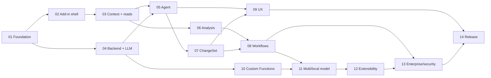

# План реализации Excel AI Assistant

**Статус:** Proposed  
**Охват:** полный продукт, без разделения на «временный MVP» и «настоящую версию»  
**Количество этапов:** 15  
**Единица оценки:** человеко-неделя (чел.-нед.)

## 1. Подход к реализации

Проект строится вертикальными срезами, но с целевой архитектурой с первого дня. Временные решения допустимы только за feature flags и не должны обходить Tool Registry, permissions, ChangeSet или privacy boundaries.

Каждый этап завершается проверяемым increment, документацией и automated tests. Следующий этап начинается только после выполнения exit criteria предыдущего либо после явно зафиксированного архитектурного исключения.

План рассчитан на полный продукт: Excel Desktop Windows, Excel Web, macOS, multi-provider AI, custom functions, local models, Windows companion, Python sandbox, MCP, enterprise controls и production rollout.

## 2. Этапы

| № | Этап | Результат | Оценка |
|---:|---|---|---:|
| 01 | Foundation и архитектурные контракты | Рабочий monorepo, CI, схемы и ADR | 3–5 чел.-нед. |
| 02 | Excel Add-in shell | Устанавливаемый Task Pane + Ribbon на трёх платформах | 4–6 чел.-нед. |
| 03 | Workbook Context и read tools | Безопасное чтение Excel с progressive context | 5–7 чел.-нед. |
| 04 | Backend, auth и LLM Gateway | Production API, streaming, providers и policies | 6–9 чел.-нед. |
| 05 | Agent Runtime и sessions | Ограниченный tool loop, состояния, память и cancel | 6–8 чел.-нед. |
| 06 | Deterministic Analysis Engine | Анализ качества, статистика, формулы и аномалии | 6–9 чел.-нед. |
| 07 | ChangeSet и безопасная запись | Preview, approve, snapshot, verify, rollback и undo | 8–12 чел.-нед. |
| 08 | Продуктовые Excel workflows | Формулы, cleaning, formatting, charts, tables, pivots | 8–12 чел.-нед. |
| 09 | Полный UX | Quick Actions, история, attachments, accessibility | 6–9 чел.-нед. |
| 10 | AI Custom Functions | AI-функции, batching, cache и recalculation safety | 5–8 чел.-нед. |
| 11 | Multi-model и local AI | OpenAI, Anthropic, Gemini, OpenRouter, Ollama/LM Studio | 6–9 чел.-нед. |
| 12 | Extensibility | MCP, skills и sandboxed Python analysis | 8–12 чел.-нед. |
| 13 | Enterprise, security и compliance | Tenant policies, audit, privacy, threat hardening | 7–11 чел.-нед. |
| 14 | Quality, packaging и rollout | Evals, E2E, performance, deployment и operations | 8–12 чел.-нед. |
| 15 | Qwen key и Windows production integration | Локальный ключ, authless Windows режим и финальная provider wiring | 2–4 чел.-нед. |

Суммарная инженерная оценка: **86–129 чел.-нед.** без учёта product discovery, юридической сертификации и длительных внешних согласований. Это не календарный срок: несколько потоков могут выполняться параллельно после стабилизации контрактов.

## 3. Зависимости

После этапа 01 можно параллельно вести add-in и backend. Этапы 06 и часть 09 также можно выполнять параллельно с Agent Runtime. ChangeSet остаётся обязательным предшественником всех пользовательских write workflows.

## 4. Общий Definition of Done

Функция считается завершённой, если:

- имеет typed contracts и runtime validation;
- не нарушает границы Office.js, LLM и ChangeSet;
- обрабатывает ошибки и cancellation;
- покрыта unit/integration tests соразмерно риску;
- имеет telemetry без утечки workbook data/secrets;
- проверена минимум на поддерживаемых Excel Requirement Sets;
- доступна с клавиатуры и имеет понятные состояния loading/error/empty;
- документирована для разработчика и пользователя;
- имеет feature flag и migration/rollback plan для рискованных изменений.

## 5. Контрольные релизные точки

Это не урезанные версии продукта, а внутренние точки контроля качества:

- **R1 — Read-only Alpha (после 06):** полноценный chat и анализ без записи.
- **R2 — Safe Editing Beta (после 09):** целостная работа с книгой через ChangeSet.
- **R3 — AI Platform RC (после 12):** custom functions, модели и расширения.
- **R4 — Production GA (после 14):** enterprise/security, packaging и эксплуатация.

## 6. Документы этапов

- [Этап 01 — Foundation](./stages/01-foundation.md)
- [Этап 02 — Excel Add-in Shell](./stages/02-addin-shell.md)
- [Этап 03 — Workbook Context](./stages/03-workbook-context.md)
- [Этап 04 — Backend и LLM Gateway](./stages/04-backend-llm.md)
- [Этап 05 — Agent Runtime](./stages/05-agent-runtime.md)
- [Этап 06 — Analysis Engine](./stages/06-analysis-engine.md)
- [Этап 07 — Change Management](./stages/07-change-management.md)
- [Этап 08 — Excel Workflows](./stages/08-excel-workflows.md)
- [Этап 09 — Product UX](./stages/09-product-ux.md)
- [Этап 10 — Custom Functions](./stages/10-custom-functions.md)
- [Этап 11 — Multi-model и Local AI](./stages/11-models-local-ai.md)
- [Этап 12 — Extensibility](./stages/12-extensibility.md)
- [Этап 13 — Enterprise и Security](./stages/13-enterprise-security.md)
- [Этап 14 — Production Rollout](./stages/14-production-rollout.md)
- [Этап 15 — Qwen и Windows production](./stages/15-qwen-production.md)

## 7. Управление планом

Для каждого этапа ведутся backlog, owner, risks и decision log. Изменение публичного контракта требует ADR. Новая write capability не может появиться вне Tool Registry и ChangeSet. Новая интеграция с данными должна пройти privacy review и получить отдельный permission scope.
